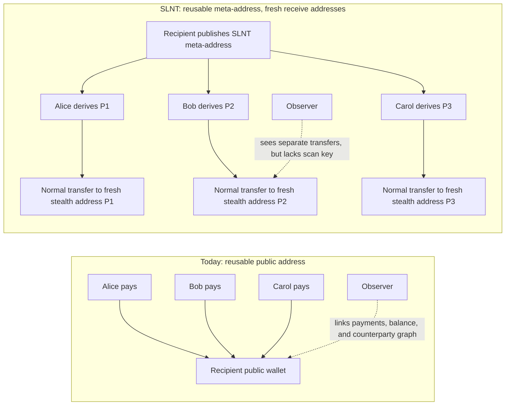
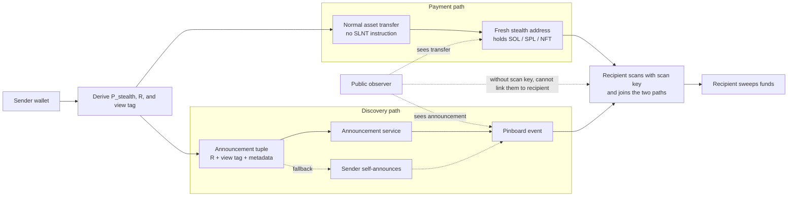

# sRFC-0042: Silent Payments for Solana

## Summary

Solana users currently have two bad options for receiving payments privately:

1. Reuse one public address and expose their balance, counterparties, and payment history.
2. Manually coordinate fresh addresses for every payment.

SLNT proposes a wallet-facing stealth-address standard for Solana. A recipient publishes one reusable SLNT meta-address. A sender uses that meta-address to derive a fresh one-time Solana address for each payment. The recipient can recognize and sweep funds from those one-time addresses, while public observers cannot link the payments back to the reusable meta-address without the recipient’s scan key.

The goal of this sRFC is to get feedback on the standard shape before treating any implementation as canonical.

---

## Motivation



Today, a reusable Solana address makes the recipient’s payment graph public. SLNT keeps the reusable-address UX, but each sender derives a fresh one-time receive address that only the recipient can recognize.

This is useful for donations, payroll, creator payments, wallet profiles, merchant payments, and any app where receiving at one public address leaks too much information.

---

## What This Draft Standardizes

This draft proposes:

- A reusable SLNT meta-address format.
- Sender-side derivation of a fresh stealth address.
- Recipient-side scanning and recognition using a scan key.
- A minimal announcement format for recipient discovery.
- Sweep behavior for moving funds out of one-time addresses.
- Optional registry support so a sender can discover a recipient’s meta-address from a known Solana wallet.

The intent is to define a common wallet and application interface, not to mandate one specific product, relayer, indexer, or hosted service.

---

## Core Flow



SLNT separates payment from discovery.

The asset transfer looks like a normal transfer to a fresh Solana address. The announcement carries only discovery data. The recipient uses their scan key to connect the two paths and sweep the funds.

This does **not** provide amount privacy, asset-type privacy, sender anonymity, or protection from all timing-correlation attacks. The privacy claim is narrower: the payment transaction itself does not reveal the recipient’s reusable meta-address, and observers without the scan key cannot directly link stealth addresses to that meta-address.

---

## Main Design Choices

### 1. Decoupled announcement by default

The payment transaction does not include an SLNT instruction. Discovery data is posted separately to an announcement layer.

This preserves a useful property: the payment path does not carry an obvious protocol marker.

### 2. Self-announce fallback

If an announcement service fails or censors, the sender can post the announcement directly. This is less private from a timing-analysis perspective, but prevents funds from becoming undiscoverable.

### 3. Optional registry

A registry can map a normal Solana wallet to an SLNT meta-address. This improves UX for senders who only know the recipient’s wallet address, but direct off-chain sharing of meta-addresses should still work.

### 4. Solana-native spend addresses

The derived stealth address is a normal Ed25519 Solana address, so it can receive SOL, SPL tokens, and NFTs using existing transfer flows.

---

## What This Draft Does Not Standardize

This draft does not attempt to standardize:

- Amount privacy.
- Asset-type privacy.
- Sender anonymity.
- Cross-chain meta-addresses.
- Encrypted memos.
- Multi-recipient announcements.
- Relayer economics.
- A canonical hosted announcement service.
- A final mainnet deployment address.

Those may be separate follow-up discussions if the core standard is useful.

---

## Feedback Requested

I would especially like feedback from:

- **Wallet teams:** Is the key-derivation flow implementable with current wallet signing and seed-access constraints?
- **Payment app developers:** Is the decoupled announcement flow acceptable UX, or does it create too much operational complexity?
- **Indexers / RPC providers:** Is scanning pinboard events practical at scale?
- **Privacy reviewers:** Are the privacy claims stated narrowly and accurately enough?
- **Security reviewers:** Are there sweep, rent, or stranded-funds edge cases this draft should handle differently?

---

## Reference Material

- Full technical draft: `link here`
- Reference implementation: `https://github.com/susruth/slnt`
- Test vectors: `link here`
```

I’d use this as the GitHub discussion body, then move the dense normative material into the linked “Full technical draft.” This makes the sRFC feel much more like an invitation to shape the standard, not a finished spec asking people to audit every byte.
