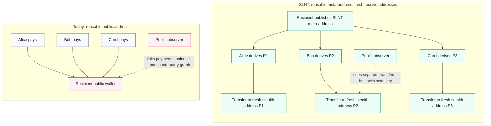
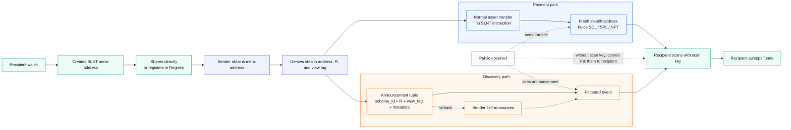

# sRFC-0042: Silent Payments for Solana

## Summary

In today's on-chain economy, publishing a receiving address often means exposing far more information than intended. Anyone can view your balance, trace incoming payments, and analyze relationships between senders and receivers.

To enable payments to flourish on Solana, we need a mechanism that allows a public receiving interface without revealing linkable payment addresses.

This RFC proposes a Solana-native silent payment standard. The high-level flow is:

1. A recipient publishes a reusable meta-address.
2. A sender uses that meta-address to derive a fresh one-time Solana address for each payment.
3. The sender transfers assets using normal Solana transfer flows, then posts a small announcement that lets the recipient discover the payment.

The goal of this sRFC is to standardize the wallet and application interface for these payments.

## Motivation

Reusable Solana addresses create a privacy and UX tradeoff. If a user publishes one wallet address, every incoming payment to that address becomes part of the same public graph. Observers can inspect balances, counterparties, payment timing, token types, and historical activity.

Generating a fresh address for every payment improves privacy, but requires coordination between the sender and recipient. That does not compose well with existing systems.

Thus, we should try to preserve the useful part of a public receiving address: one stable identifier that people and apps can use. The difference is that this identifier is not itself the destination of funds. Instead, it lets each sender derive a unique Solana address for that payment.

## Existing vs. Proposed Design



## Architecture



Notes:

- The asset transfer is a normal transfer to a fresh Solana address.
- The announcement carries only discovery data.
- The recipient uses their scan key to connect the two paths and sweep the funds.

### Pinboard

For recipients to discover payments sent to fresh stealth addresses, we create a Pinboard (or announcement surface) for this discovery data.

A Pinboard announcement contains the public values needed for recipient scanning:

- `scheme_id`, identifying the cryptographic scheme.
- `ephemeral_pub`, the sender's ephemeral public value `R`.
- `view_tag`, a short filter used to reject non-matching announcements cheaply.
- `metadata`, an opaque field for minimal implementation-defined context.

Pinboard does not route payments or act as a relayer for the asset transfer. We intentionally keep asset transfer and announcements separate to give us two useful properties:

- The payment transaction can remain a normal Solana transfer.
- Wallets and indexers can scan a common announcement stream instead of searching the entire chain for possible stealth payments.

Pinboard should be treated as an announcement layer, not as the privacy mechanism itself. Privacy comes from the derivation scheme and the recipient's scan key.

The reference implementation uses a small, stateless Anchor program for Pinboard. The candidate program ID is:

```text
SLNTPDxgFKwSZ31CbbdSKKHyRpBpKjEMYVj2gpGxkN2
```

This sRFC should not depend on a final mainnet deployment until the interface is reviewed, audited, and finalized.

Pinboard instructions:

| Instruction | Arguments | Accounts | Behavior |
|---|---|---|---|
| `post` | `scheme_id`, `ephemeral_pub`, `view_tag`, `metadata` | `fee_payer: Signer` | Emits one announcement. |
| `post_batch` | `entries: Vec<NoteEntry>` | `fee_payer: Signer` | Emits one announcement per entry. |

Announcement shape:

```rust
Note {
  scheme_id: u16,
  ephemeral_pub: [u8; 32],
  view_tag: u8,
  metadata: Vec<u8>,
}
```

Limits and validation:

- `metadata` is capped at 64 bytes per announcement.
- `post_batch` requires 1 to 50 entries.
- `scheme_id` is recorded but not validated by the program. v1 clients process `0x0001` and ignore unsupported schemes.

### Registry

A recipient can share their meta-address directly, but direct sharing is not always good UX. In many cases, a sender may only know a recipient's normal Solana wallet address.

Registry is an optional discovery layer that maps a known Solana wallet to a silent meta-address. This is not required for silent payments to work. A sender who already has the recipient's silent meta-address can derive a stealth address without using Registry. However, Registry improves discoverability.

Registry should support basic wallet expectations:

- Recipients can publish a meta-address.
- Recipients can rotate a meta-address.
- Recipients can remove a meta-address.
- Senders can verify that a registry entry was authorized by the owning wallet.
- Wallets can distinguish direct meta-address input from registry-based lookup.

The reference implementation uses a small Anchor program for Registry. The candidate program ID is:

```text
SLNTRCsjJXUQM3UbHjgJ48xe4GjKFSiLmrF1mXA8Vn2
```

Registry stores one meta-address entry per `(registrant, scheme_id)` pair.

Entry PDA:

```text
["meta", registrant, scheme_id_le_bytes]
```

Instructions:

| Instruction | Arguments | Accounts | Behavior |
|---|---|---|---|
| `register` | `scheme_id`, `payload` | `registrant: Signer`, `entry`, `system_program` | Creates the registrant's meta-address entry. |
| `update` | `scheme_id`, `payload` | `registrant: Signer`, `entry` | Replaces the stored meta-address payload. |
| `close` | `scheme_id` | `registrant: Signer`, `entry` | Removes the entry and returns rent to the registrant. |

Stored entry:

```rust
MetaAddressEntry {
  registrant: Pubkey,
  scheme_id: u16,
  bump: u8,
  version: u8,
  b_spend: [u8; 32],
  b_scan: [u8; 32],
  flags: u8,
}
```

Payload for `register` and `update`:

```rust
MetaAddressPayload {
  version: u8,
  b_spend: [u8; 32],
  b_scan: [u8; 32],
  flags: u8,
}
```

Validation:

- `scheme_id` must be non-zero.
- `payload.version` must be `1`.
- `payload.flags` must be `0`.
- `update` and `close` require the entry PDA to match the signing registrant.

Events mirror state changes: `MetaAddressRegistered`, `MetaAddressUpdated`, and `MetaAddressClosed`.

## Privacy Model

The main privacy goal is recipient unlinkability from the reusable meta-address.

A public observer may see:

- the asset transfer
- the destination stealth address
- the Pinboard announcement
- token type and amount
- transaction timing
- later sweep activity

The observer should not learn, from the transfer alone, which reusable silent meta-address the payment was derived from.

This is a limited privacy claim. This RFC does not provide amount privacy, asset-type privacy, sender anonymity, network-level privacy, or complete protection against timing correlation. If a sender announces immediately and the recipient sweeps immediately, an observer may still make probabilistic inferences.

The standard should be judged on whether it gives wallets a practical recipient-privacy primitive that is meaningfully better than address reuse while still fitting Solana's existing account and token model.

## Design Choices

### Decoupled Announcements

The default design separates the payment transaction from the announcement.

This avoids marking the asset transfer itself as a silent payment. It also allows different announcement services, indexers, and wallet backends to exist without changing how assets are transferred.

The tradeoff is operational complexity. If announcements are delayed, censored, or lost, the recipient may not discover the payment promptly. The draft therefore includes a self-announce fallback.

### Self-Announce Fallback

If the sender cannot use an announcement service, they can publish the announcement directly to Pinboard.

This is less ideal for privacy because timing correlation may become easier, but it avoids a worse failure mode where funds arrive at a stealth address and the recipient never discovers them.

Feedback is needed on whether this fallback should be required, optional, or handled entirely outside the standard.

### Optional Registry

Registry improves UX when a sender knows only the recipient's normal wallet address. However, direct sharing of silent meta-addresses should remain valid.

Registry should be treated as a discovery convenience, not as the core privacy mechanism.

### Normal Solana Receive Addresses

The derived stealth address is a normal Solana address. This allows us to support SOL, SPL tokens, and NFTs without requiring new token programs or special transfer instructions.

## Feedback Requested

I would especially like feedback on the following questions:

1. **Wallet integration:** Is this derivation and scanning model practical for Solana wallets, given current key-management constraints?
2. **Pinboard interface:** Is the `Note` event shape sufficient for wallet discovery without leaking unnecessary linkage information?
3. **Announcement reliability:** Should the standard require self-announcement as a fallback, or leave fallback behavior to implementations?
4. **Privacy claims:** Are the privacy guarantees stated narrowly enough? Are there realistic linkage attacks the draft should address more directly?
5. **Indexer support:** Is scanning Pinboard events practical for RPC providers, indexers, and wallet backends at scale?

## Reference Material

- Reference implementation: <https://github.com/susruth/slnt>
- Pinboard program source: <https://github.com/susruth/slnt/blob/main/programs/pinboard/src/lib.rs>
- Registry program source: <https://github.com/susruth/slnt/blob/main/programs/registry/src/lib.rs>
- Full technical draft: <https://github.com/susruth/slnt/blob/main/docs/srfc/0001-slnt-silent-payments.md>
- Test vectors: <https://github.com/susruth/slnt/blob/main/test-vectors.json>
